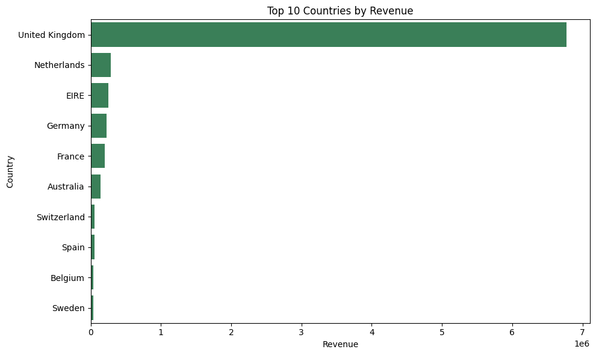
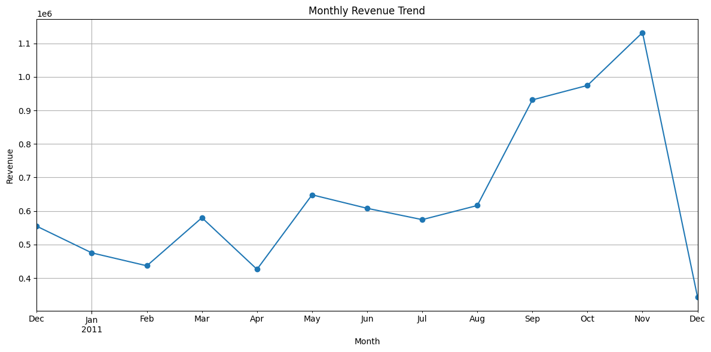
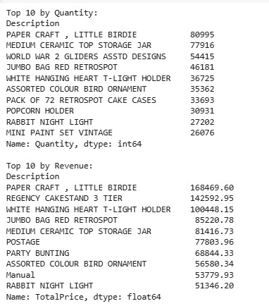

 # **E-Commerce Customer Segmentation using RFM, K-Means & PCA**
### ***By Neha G Naidu***
 ****

**Basic Overview** 

*This project aims to analyze customer purchasing behavior for an online retail store using transaction data. Using **RFM (Recency, Frequency, Monetary)** analysis and **K-Means clustering**, customers are segmented into distinct groups to support **personalized marketing, customer retention, and business growth.***  
***Techniques used***: *Data cleaning, exploratory data analysis (EDA), feature engineering, clustering, and visualization.*

**Objective of the Analysis**

  - *Analyze **customer purchasing behavior** using **RFM metrics***
  - *Segment customers into distinct groups using **K-Means clustering***
  - *Gain actionable insights to support **personalized marketing** and **improve business performance***

**🛠️ Tech Stack** 

**Languages**: *Python* 
**Libraries**: *pandas, numpy, matplotlib, seaborn, scikit-learn* 
**Techniques**: *RFM Analysis, K-Means Clustering, PCA (Dimensionality Reduction)* 
**Dataset**: [Kaggle](https://www.kaggle.com/datasets/carrie1/ecommerce-data) (originally from the UCI Machine Learning Repository)

**📂 Dataset Details** 

**Transactions**: *~541,909* 
**Customers**: *~4,300 unique customers* 
**Time period**: *Dec 2010 – Dec 2011* 
**Features**: *InvoiceNo, StockCode, Description, Quantity, UnitPrice, InvoiceDate, CustomerID, Country* 
**Products**: *Unique, all-occasion gift items* 
**Customers**: *Includes both individual buyers and wholesalers*

**🔍 Data Preprocessing** 
- *Removed missing **CustomerID** and **Description** entries (~25%).*
- *Filtered **invalid** transactions (negative quantities & prices).*
- *Added **TotalPrice** feature (Quantity × UnitPrice).*

**📊 Exploratory Data Analysis (EDA)** 

**Key insights**:
- **Net Revenue**: *£8.3M+* 
- **Items Sold**: *5.1M+* 
- **Top Country**: *UK (~90% of revenue)* 
- **Top Products**: *Paper Craft, Little Birdie, Regency Cake Stand* 
- **Trends**: *Post-holiday dip (Jan–Feb), peak in Q4 (Sep–Nov)*. 

**Visualizations**
- **Top 10 Countries by Revenue**  
  

- **Monthly Revenue Trend**  
    

- **Top 10 Products by Quantity and Revenue**
  

**🤖 Customer Segmentation (K-Means)** 
- *Used Elbow Method → optimal k=4.*

Segmented customers into 4 groups: 

| Cluster | Label                | Characteristics                 | Strategy                 |
| ------- | -------------------- | ------------------------------- | ------------------------ |
| 0       | Occasional Buyers    | Low frequency, medium spend     | Nurture with offers      |
| 1       | Frequent Buyers      | Regular purchases, steady spend | Upsell & loyalty rewards |
| 2       | High-Value Loyalists | Recent, frequent, high spend    | Retain with VIP perks    |
| 3       | Dormant Customers    | Long inactive, low spend        | Re-engagement campaigns  |

 **PCA Visualization of Clusters**  
  .png) 

**📈 Key Findings** 

- *Revenue is highly UK-concentrated, international markets underperform.*
- *Strong Q4 sales surge, weak Q1 demand.*
- *A few key products drive revenue disproportionately.*
- *Customer base includes valuable loyalists, but many are at risk of churn.*

**💡 Recommendations** 

- ***Retain High-Value Loyalists** → loyalty programs, exclusive offers.*
- ***Upsell Frequent Buyers** → personalized recommendations, cart reminders.*
- ***Convert Occasional Buyers** → welcome campaigns, discounts.*
- ***Reactivate Dormant Customers** → win-back emails, time-limited incentives.*
- ***Expand internationally** → test marketing in top 2–3 foreign markets.*

